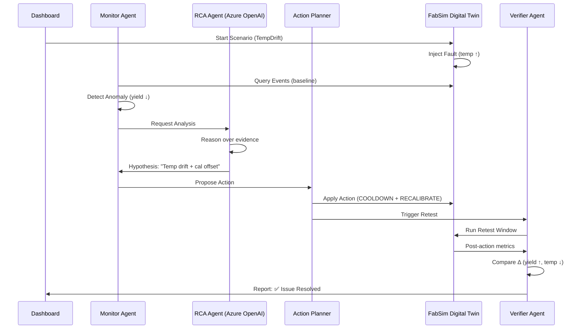

# FabTwin Orchestrator

**Agentic Semiconductor ATE Digital Twin Orchestration System on Azure**


## 🎯 Overview

FabTwin Orchestrator is an intelligent digital twin system that autonomously detects, diagnoses, and remediates semiconductor Automatic Test Equipment (ATE) issues using AI agents. Built on Azure with Microsoft Agent Framework, it demonstrates a closed-loop workflow: **Observe → Analyze → Act → Retest → Verify**.

### Key Innovation

Unlike traditional reactive systems, FabTwin uses coordinated AI agents to:
- **Detect** anomalies in real-time telemetry (yield drops, alarms, timeouts)
- **Diagnose** root causes using Azure OpenAI reasoning
- **Act** autonomously with policy-enforced safe actions
- **Verify** effectiveness through automated retesting
- **Report** with executive summaries and audit trails

---

## 🏗️ Architecture

### Four-Layer Design

```
┌─────────────────────────────────────────────────────────────────┐
│                        User / UI Layer                          │
│                     (Blazor Dashboard)                          │
│  • Yield Trends  • Alarms  • RCA Results  • Retest Deltas     │
└─────────────────────────────────────────────────────────────────┘
                              ▼
┌─────────────────────────────────────────────────────────────────┐
│                   Agentic Control Plane                         │
│              (Microsoft Agent Framework Host)                   │
│  • Monitor Agent  • RCA Agent  • Action Planner                │
│  • Executor  • Verifier  • Reporter                            │
│  • Policy & Guardrails  • Scenario Runner                      │
└─────────────────────────────────────────────────────────────────┘
                              ▼
┌─────────────────────────────────────────────────────────────────┐
│               Digital Twin & Data Plane                         │
│           (FabSim ATE Simulator + Event Store)                 │
│  • Instrument Model  • Fault Injection Engine                  │
│  • Telemetry Events  • Alarm Logs  • Test Results             │
└─────────────────────────────────────────────────────────────────┘
                              ▼
┌─────────────────────────────────────────────────────────────────┐
│                  Azure Platform Services                        │
│  • Azure OpenAI (GPT-4)  • Tool Gateway (MCP APIs)            │
│  • App Service / Container Apps  • Application Insights       │
└─────────────────────────────────────────────────────────────────┘
```

---

## 🔄 Closed-Loop Workflow



---

## 🧪 Demo Scenarios

FabTwin implements **9 realistic ATE equipment/test-system issues** (MVP: 3 scenarios):

### Implemented (MVP)

1. **TempDrift** - Temperature rise causes calibration drift and yield loss
   - **Fault**: temp ↑ → calOffset ↑ → measuredValue bias ↑ → yield ↓
   - **Actions**: `COOLDOWN`, `RECALIBRATE`
   - **Verification**: Yield recovers to baseline

2. **SupplyFault** - Power supply fault latch requires reset
   - **Fault**: Voltage drops to 0V → test abort → critical alarm
   - **Actions**: `RESET_SUPPLY`, `REINIT_SEQUENCE`
   - **Verification**: Fault cleared, test resumes

3. **NoiseIntermittent** - Signal noise causes intermittent failures
   - **Fault**: noiseSigma ↑ → intermittent fails ↑
   - **Actions**: `RESEAT_CONNECTION`, `SWAP_CABLE`
   - **Verification**: Noise sigma returns to baseline

### Planned (Stretch Goals)

4. Trigger Timing / Missed Trigger
5. Missing Instrument → Endless Loop
6. Electronic Load Mis-Range
7. Programming Toolchain Version Mismatch
8. Spec/Configuration Resolver Mismatch
9. Protocol Address/Parsing Error

---

## 🛠️ Tech Stack

| Component | Technology |
|-----------|-----------|
| **Frontend** | Blazor Server (.NET 9) |
| **Backend** | ASP.NET Core Minimal APIs |
| **Agents** | Microsoft Agent Framework |
| **LLM** | Azure OpenAI (GPT-4) |
| **Tool Calling** | MCP-style Tool Gateway |
| **Data Store** | In-memory + JSON (upgradable to Azure Cosmos DB) |
| **Hosting** | Azure App Service / Container Apps |
| **Observability** | Application Insights |
| **DevOps** | GitHub + VS Code + GitHub Copilot |

---

## 🚀 Getting Started

### Prerequisites

- .NET 9 SDK
- Azure subscription (for OpenAI)
- Visual Studio Code (recommended)

### Installation

```bash
# Clone repository
git clone https://github.com/yourusername/fabtwin-orchestrator.git
cd fabtwin-orchestrator

# Restore dependencies
dotnet restore

# Build solution
dotnet build

# Run web application
cd FabTwin.Web
dotnet run
```

### Configuration

Create `appsettings.Development.json` in `FabTwin.Web/`:

```json
{
  "AzureOpenAI": {
    "Endpoint": "https://your-instance.openai.azure.com/",
    "ApiKey": "your-api-key",
    "DeploymentName": "gpt-4"
  }
}
```

---

## 📊 Project Structure

```
fabtwin-orchestrator/
├── FabTwin.Core/              # Core domain logic
│   ├── Models/                # Data contracts
│   │   ├── ScenarioId.cs      # Enum: TempDrift, SupplyFault, etc.
│   │   ├── TelemetryEvent.cs  # Timestamped equipment metrics
│   │   ├── AlarmEvent.cs      # Fault/warning events
│   │   ├── TestResult.cs      # Pass/fail test outcomes
│   │   ├── ActionCommand.cs   # Remediation actions
│   │   └── RetestReport.cs    # Before/after comparison
│   ├── Engine/                # Digital twin simulator
│   │   ├── FabSimEngine.cs    # Scenario execution engine
│   │   └── ScenarioState.cs   # Runtime state tracker
│   └── Data/                  # Event storage
│       └── EventStore.cs      # In-memory event store
│
├── FabTwin.Web/               # Blazor UI + Agent host
│   ├── Components/
│   │   └── Pages/
│   │       └── Dashboard.razor  # Main UI
│   ├── Services/              # (Planned)
│   │   ├── AgentOrchestrator.cs
│   │   └── ToolGateway.cs
│   └── Program.cs
│
└── README.md
```

---

## 🎯 Roadmap

### Week 1: MVP (Current)
- [x] Digital twin with 3 scenarios
- [x] Fault injection + deterministic seeds
- [x] Event store with query APIs
- [x] Basic Blazor dashboard
- [ ] MCP Tool Gateway (5 tools)
- [ ] Agent orchestration (3 agents)
- [ ] Azure OpenAI integration

### Week 2: Full Loop
- [ ] Complete Observe → Analyze → Act → Retest → Verify
- [ ] Policy enforcement + guardrails
- [ ] Executive summary generation
- [ ] Retest comparison visualization

### Week 3: Deployment
- [ ] Azure App Service deployment
- [ ] Application Insights integration
- [ ] Performance metrics (time-to-detect, time-to-recover)
- [ ] Demo video recording

---

## 🔧 MCP Tool Gateway

The system exposes 5 tools for agent interaction:

| Tool | Purpose | Returns |
|------|---------|---------|
| `query_events` | Fetch telemetry/alarms for a time window | Events JSON |
| `get_specs` | Retrieve test specifications | Spec limits |
| `apply_action` | Execute remediation action | Success/failure |
| `run_retest` | Trigger controlled retest | Retest metrics |
| `store_report` | Save audit trail | Report ID |

---

## 🤖 Agent Architecture

### 3-Agent Closed Loop

1. **Detector + RCA Agent**
   - Monitors telemetry for anomalies
   - Uses Azure OpenAI to reason over evidence
   - Produces ranked hypotheses with confidence scores

2. **Planner + Executor Agent**
   - Selects safe action from policy-allowed list
   - Applies action to digital twin
   - Logs action history for audit

3. **Verifier + Reporter Agent**
   - Triggers automated retest window
   - Compares baseline vs post-action metrics
   - Generates executive summary with LLM
   - Marks incident as resolved or escalates

---

## 📈 Success Metrics

FabTwin tracks:
- **Time to Detect** - Anomaly detection latency
- **Time to Diagnose** - RCA hypothesis generation time
- **Time to Recover** - End-to-end remediation duration
- **Resolution Rate** - % of issues auto-resolved
- **False Positive Rate** - Incorrect diagnoses

---

## 🔒 Safety & Compliance

### Guardrails
- **Allowed Actions List** - Only pre-approved safe actions
- **Rate Limiting** - Prevents action flooding
- **Approval Mode** - Optional human-in-the-loop
- **Audit Trail** - Complete evidence → action → outcome logging

### Scenario Runner
- Demo mode with seeded faults for reproducibility
- Isolated execution (no real equipment impact)
- Rollback capability for failed actions

---

## 📚 References

### Vendor Documentation (Public)
Scenario playbooks derived from public troubleshooting guides:
- Keysight Technologies
- National Instruments
- Chroma ATE
- Tektronix

### Hackathon
Built for **Microsoft AI Dev Days Hackathon (March 2026)**

---

## 👥 Contributors

- **Vaibhav** - Solo Developer

---

## 📄 License

This project is licensed under the MIT License.

---

## 🙏 Acknowledgments

- Microsoft Agent Framework team
- Azure OpenAI service
- Semiconductor test engineering community

---

## 📞 Contact

For questions or collaboration:
- GitHub Issues: [Create an issue](https://github.com/yourusername/fabtwin-orchestrator/issues)
- Email: your.email@example.com

---

**Built with ❤️ for smarter semiconductor manufacturing**
